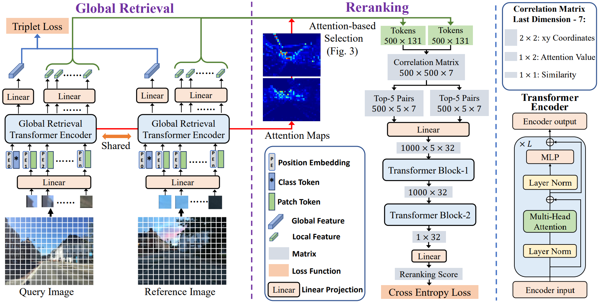

# $R^{2}$ Former: Unified $R$ etrieval and $R$ eranking Transformer for Place Recognition

This is the official repository for the CVPR 2023 (Hightlight) paper: [$R^{2}$ Former: Unified $R$ etrieval and $R$ eranking Transformer for Place Recognition](https://openaccess.thecvf.com/content/CVPR2023/html/Zhu_R2Former_Unified_Retrieval_and_Reranking_Transformer_for_Place_Recognition_CVPR_2023_paper.html).

 

```
@inproceedings{zhu2023r2former,
  title={R2former: Unified retrieval and reranking transformer for place recognition},
  author={Zhu, Sijie and Yang, Linjie and Chen, Chen and Shah, Mubarak and Shen, Xiaohui and Wang, Heng},
  booktitle={Proceedings of the IEEE/CVF Conference on Computer Vision and Pattern Recognition},
  pages={19370--19380},
  year={2023}
}
```

## Overview

In this paper, we propose a unified place recognition framework that handles both retrieval and reranking with a novel transformer model, named R2Former. The proposed reranking module takes feature correlation, attention value, and xy coordinates into account, and learns to determine whether the image pair is from the same location. The whole pipeline is end-to-end trainable and the reranking module alone can also be adopted on other CNN or transformer backbones as a generic component.

- The global retrieval part is implemented based on [VG Benchmark](https://github.com/gmberton/deep-visual-geo-localization-benchmark), and we add the [ViT-based backbone](https://github.com/facebookresearch/deit) with variable input resolution.
- For MSLS training, we use the official [Mapillary](https://github.com/mapillary/mapillary_sls) code base. The other datasets are  prepared using [datasets_vg](https://github.com/gmberton/datasets_vg). 
- We add the improved full-dataset mining and fix a bug in [VG Benchmark](https://github.com/gmberton/deep-visual-geo-localization-benchmark) dataloader. 
- We add the reranking evaluation in "test.py" and R2Former reranking module in "./model/".

## Setup
Download the MSLS dataset from [Mapillary](https://www.mapillary.com/dataset/places) and unzip the files.
Install the python environment using 

```
pip3 install -r requirements.txt
pip3 install torch==1.12.1+cu113 torchvision==0.13.1+cu113 torchaudio==0.12.1 --extra-index-url https://download.pytorch.org/whl/cu113
```

### Test with Pre-trained Models
Download pretrained model "CVPR23_DeitS_Rerank.pth" from [R2Former](https://drive.google.com/drive/folders/14dkj0o0NpAD_1MB0Kqt7NiGxR5ekOdN_?usp=sharing). Modify the path of MSLS dataset. Run the test script:
```commandline
bash test.sh
```
Note that the first time of loading MSLS dataset will be very slow, because it will scan all the images and generate positive candidates for each query. We save all the results so that the next time would be very fast.

### Training - Separately
Firstly, download the pretrained global retrieval model from [msls_v2_deits.pth](https://drive.google.com/file/d/1XBNjbbNUrp6NIv6REHrMLdHFw5joustx/view?usp=sharing) or train the global retrieval model using:
```commandline
bash train_global_retrieval.sh
```
You may need to change the dataset directory in the command. Place the trained global retrieval model in the main directory. 

Download the pre-computed mining results from [msls_v2_deit_hard_final.npy](https://drive.google.com/file/d/1dv5MTjMju0ZYZexalAZKaTJgP7eoEwaK/view?usp=sharing), which is generated using the global retrieval model (see "pre_compute_mining.py"). Train the reranking module using:
```commandline
bash train_reranking.sh
```
The finetuning code is included, uncomment the last command to finetune on Pitts30K.

### Training - End-to-end
Run the script:
```commandline
bash train_end_to_end.sh
```

## Acknowledgements
Parts of this repo are inspired by the following great repositories:
- [VG Benchmark](https://github.com/gmberton/deep-visual-geo-localization-benchmark)
- [Mapillary](https://github.com/mapillary/mapillary_sls)
- [datasets_vg](https://github.com/gmberton/datasets_vg)
- [DeiT](https://github.com/facebookresearch/deit)
- [Patch-NetVLAD](https://github.com/QVPR/Patch-NetVLAD)
- [NetVLAD's original code](https://github.com/Relja/netvlad)